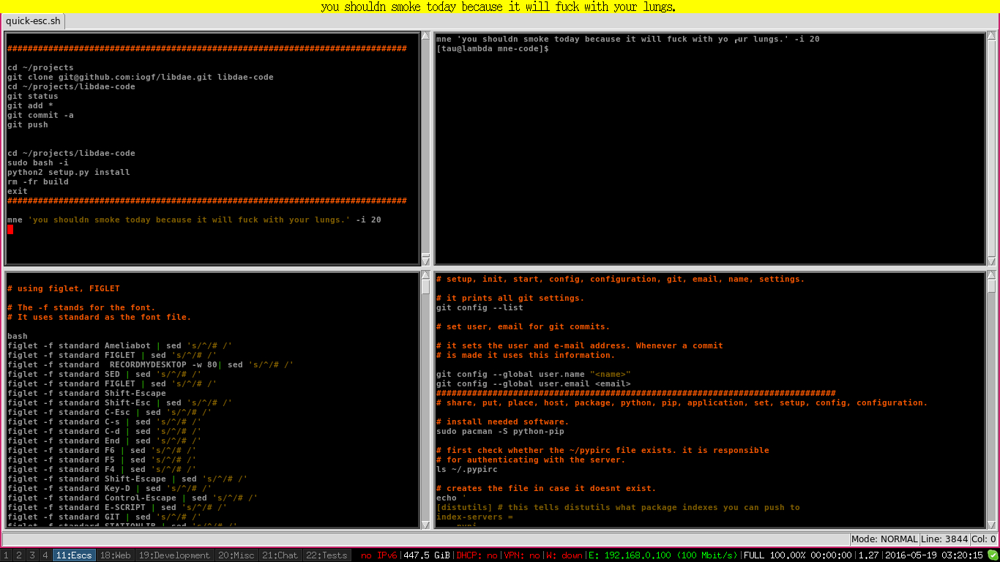

mnem
====

A note reminder that uses dzen2 to display notes

**Note:** The word mnem comes from mnemmosyne greek word.

Install
=======

It is needed to have python2 installed.

    pip install python-daemon
    pip install mnem

Note: It demands dzen2 menu to display the reminders.
It is problable that your linux distribution lets you easily
install that.

**See:** https://github.com/robm/dzen

Screenshot
==========

Usage
=====

It is needed first to start mnem daemon, in order to do that just issue the command below:

    mnem-daemon

That is enough to have mnem daemon running. 
Figure out how to execute mnem at your graphical environment startup.

mnem accepts the following parameters:

    [tau@lambda mnem-code]$ mnem -h
    usage: mnem [-h] [-y [YEARS [YEARS ...]]] [-m [MONTHS [MONTHS ...]]]
               [-d [DAYS [DAYS ...]]] [-u [HOURS [HOURS ...]]]
               [-i [MINUTES [MINUTES ...]]] [-a] [-f] [-r]
               [msg]
    
    positional arguments:
      msg                   Messages
    
    optional arguments:
      -h, --help            show this help message and exit
      -y [YEARS [YEARS ...]], --years [YEARS [YEARS ...]]
                            List of ears.
      -m [MONTHS [MONTHS ...]], --months [MONTHS [MONTHS ...]]
                            List of months.
      -d [DAYS [DAYS ...]], --days [DAYS [DAYS ...]]
                            List of days.
      -u [HOURS [HOURS ...]], --hours [HOURS [HOURS ...]]
                            List of hours.
      -i [MINUTES [MINUTES ...]], --minutes [MINUTES [MINUTES ...]]
                            List of minutes.
      -a, --add             Add a note.
      -f, --find            Find a note based on a regex.
      -r, --remove          Remove a note based on a regex.
    [tau@lambda mnem-code]$     
    
When mnem doesnt find one of the parameters -i -m, -y, -u, -d it assumes the current values 
for years, minutes, days etc. When it finds these parameters and they aren't followed by
values then it assumes all possible values for the given parameter.

So, if you run the following command:

    mnem -a 'this is a note' -u -i 40

It will assume years=current, months=current, days=current, hours=24, minutes=40

**Display a note daily**

    mnem -a 'it will be shown every day until the end of the month.' -d  

**Display a note monthly**
  
    mnem -a 'Title
    It is a message.
    ' -m 

The above command will assume days=current, years=current, minutes=current.
So, the message above will be displayed every month in the same time of the day
that the command was issued.

**Display a note monthly on a specific day**
  
    mnem -a 'Testing' -m -d 1 
  

The above command tells mnem to display the note every month for the current year
in the first day of the month.

**Display a note daily at a specific time**
  
    mnem -a 'Cool note.' -m  -d  -r 15 -e 30 
    
    
**Display a note on a specific date**

    
    mnem -a 'this is a note.' -y 2016 2018 -m 3 -u 10 -i 44 -d 18

It will display a note when it is 18/03/2016 at 10:44 am. and when it is
18/03/2018 at 10:44 too.

**Find notes**

    mnem -f 'some.+regex'

It finds all set of notes that matches the regex.

**Remove notes**

    mnem -f 'some.+regex'

It removes all notes whose msg matches the regex.

